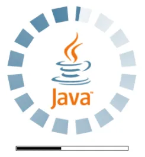

# JavaScript has a strange history!

- built within **10 days** in May 1995 by Brendan Eich for Netscape Navigator

- enhance static web pages with dynamic content by scripting

- embed and communicate with Java applets

    
    
    

<!--
D: Just 10 days!! What good can come out of that?

A: Well, our father did a very big project in just 6 days, remember?
-->

---
class: devil
---

# Node.js has a strange history!

- Ryan Dahl brought JavaScript to the server in 2009

- criticized the "blocking" nature of I/O in traditional web servers like Apache

- 2010 npm was created to host and distribute modules

    
    <LightOrDark>
        <template #dark></template>
        <template #light></template>
    </LightOrDark>
    
    

<!--
- ported V8 JavaScript engine from Google Chrome to Linux
-->

---
title: The History of the Web Development
class: devil
layout: center
---

<Youtube id="aXcuz6fn8_w" height="500px" />

<!--
- from here on, web development turned into a big dumpster fire
-->

---
class: angel
---

# History doesn't matter

    <ul class="max-w-1/2">
        <li>Java was created in 1995 at Sun Microsystems for interactive television.</li>
        <li>Python was created in 1991 for Amoeba OS (a distributed operating system) which was not continued after a few versions.</li>
        <li>Lua was created in 1993 as an embeddable scripting language for extending applications.</li>
    </ul>
    

        
        
        
    

<!--
A:
- Java: now used on embedded devices, Android, and server-side applications
- Python: now used in data science, machine learning, web development, and more
- Lua: now very big game development
-->
