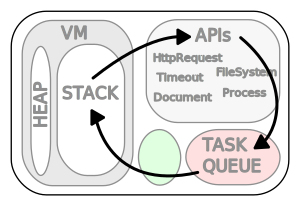

# JavaScript is Single-Threaded

<v-clicks>

- the JavaScript VM runs only a **single thread**

- it can only execute **one piece** of JS **at a time**

- **no parallel execution** of JavaScript code because of event loop

</v-clicks>

<!--
D: stress out that it is single-threaded
D: when you want to downgrade your backend speed... [click]
-->

---
title: Potatoes running DOOM
layout: center
class: devil
---


<!--
D: you might as well run your server on a calculator supplied by potatoes.

D: When Dahl presented Node.js, he was really motivated about the event loop. [click]
-->

---
class: devil
layout: center
title: Ryan Dahl motivated
---

<SlidevVideo controls autoplay>
    <source src="./RyanDahl_motivated.mp4" type="video/mp4" />
</SlidevVideo>

<!--
*wait for video to finish*

D: But later at JSConf 2018 this sounded a lot different. [click]
-->

---
class: devil
layout: center
title: Ryan Dahl apologizes
---

<SlidevVideo controls autoplay>
    <source src="./RyanDahl_regret.mp4" type="video/mp4" />
</SlidevVideo>

<!--
*wait for video to finish*

A: Aren't you taking things very out of context here?

D: Of course, I am trying to make an argument here!

A: Do you even know what an event loop is?

A: Let me explain what makes JavaScript special [click]
-->

---
class: angel
layout: center
title: Definition of JavaScript
---

<div class="text-center">
    <h1>JavaScript is a</h1>
    <h2>single-threaded<br />non-blocking<br />asynchronous<br />concurrent<br /></h2>
    <h2 class="mt-4">language</h2>
</div>

<!--
A: *read slide*

A: In other words: The JavaScript Runtime runs JavaScript Code in a single thread, but provides concurrency with via asynchronity in a non-blocking way through the runtime by using the event loop.

D: Whut?

A: Let me explain by showing you the architecture of the JavaScript Runtime. [click]
-->

---
title: JavaScript Runtime Architecture
class: angel
layout: center
---

<v-click hide>

</v-click>

<v-click at="1">

</v-click>

<!--
*A exclusively*

On the left JavaScript VM (Google V8)
- single heap and single stack

On the right APIs
- HttpRequest, Timeout, Document
- in case of Node.js: FileSystem, Process, but no Document

Bottom:
- Task Queue
- Event Loop in green


When you now use a API [click] like setTimeout, you call the Runtime API with a callback. And continue executing code from stack.

Once the Timeout is reached, the Runtime puts callback into the Task Queue.

When the stack is empty, the Event Loop takes the first task from the Task Queue and puts it into the stack.

D: So as a result, I should push tasks into the Runtime and not do them in JavaScript?

A: Yes, exactly! There's a lot of ways to do that. [click]
-->

---
class: angel
---

# Offloading to other Servers

- let other servers do the heavy lifting

- fetch data via ReST, GraphQL, gRPC, etc.

<ChuckNorris class="pt-5" v-click />

<!--
[click]

Select Chuck Norris joke.
-->

---
class: angel
---

# Use Workers

- run JavaScript in a separate thread

- communicate with the main thread via message passing

- available in the browser (Web Workers) and Node.js (Worker Threads)

<WebWorker class="pt-5" v-click />

<!--
[click]
*start workers*
-->

---
class: angel
---

# Using WASM

- run code in from another language that compiles to WebAssembly

- low-level bytecode that runs in the browser or Node.js

<v-click>

```wasm {monaco}
  (module
    (func (export "add") (param i32 i32) (result i32)
       local.get 0 local.get 1 i32.add
    ))
```

<WASM class="pt-5" />

</v-click>

<!--
*read slide* [click]

A: Web Assembly Text for a function that adds two numbers.

*explain how to read it*

D: You expect me to write code like this?

A: No, this just makes WASM, which is binary code, readable.
A: A lot of languages can compile to WASM, like Rust, C, C++, Go, etc.
-->

---
class: angel
---

# Node.js Add-on SDK

- write C++ code that can be called from JavaScript

- can be used to access low-level system APIs

<!--
A: *explain slide*

D: No example this time?

A: No, C++ examples get big and complicated quickly. Besides, we can't run them in this presentation because the browser environment is sandboxed.
-->

---
class: angel
title: Summary for Using JavaScript effectively
---

# Summary

- JavaScript is single-threaded, but can run code in the background

<v-click>

- Offloading

  - Call APIs
  - Use Workers
  - Use WASM
  - Use Native Code (Node.js)

</v-click>
