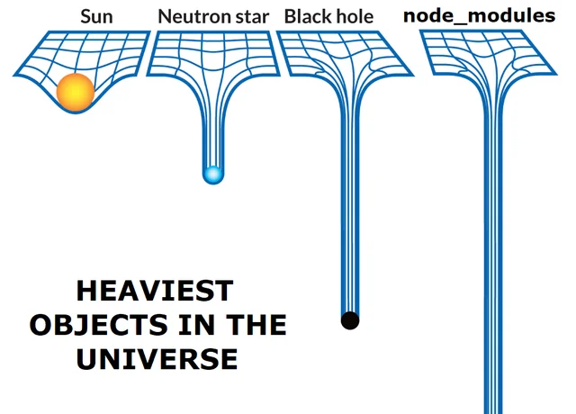

# JavaScript Fullstack Temptation

## 😇 Heaven-Sent or Hell-Bound? 😈

<!--
INTRO
-->

---
src: pages/history-of-javascript.md
---

---
src: pages/javascript-is-weird.md
---

---
title: node_modules
---

<!--
D: JS package manager download the entire internet for every project.
  - unknown sources
  - vulnerabilities

A: same problem for Maven and NuGet.
  - npm audit
  - exploit database
  - support on GitHub
-->
